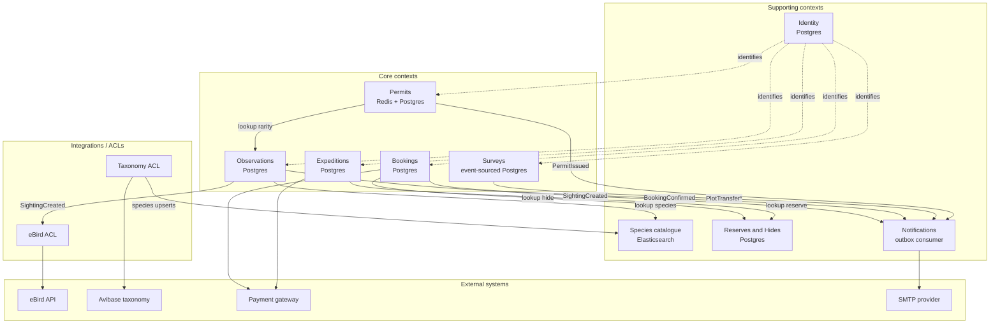

# Context Map & Module Layout

Companion to [domain_context.md](domain_context.md). Shows how the bounded contexts relate, and how the Kotlin code is organised to enforce those boundaries.

---

## 1. Context map

Relationships between contexts, grouped by role. Arrows point in the direction of dependency.



### 1.1 Integration styles (DDD vocabulary)

| From → To                    | Style                   | Why                                                                  |
|------------------------------|-------------------------|----------------------------------------------------------------------|
| Observations → Species       | Conformist              | Species is upstream and stable; we accept its model as-is.           |
| Bookings → Reserves          | Customer / Supplier     | Bookings drives requirements (capacity, opening hours) upstream.     |
| * → Identity                 | Conformist              | Everyone trusts identity; no one negotiates its model.               |
| * → Notifications            | Published Language      | Notifications consumes well-defined event contracts.                 |
| Observations → eBird         | Anti-Corruption Layer   | External model is messy and unstable; we translate at the boundary.  |
| Taxonomy feed → Species      | Anti-Corruption Layer   | Same reason.                                                         |

---

## 2. Module layout (Spring Modulith)

Each context is a top-level package. [Spring Modulith](https://docs.spring.io/spring-modulith/reference/) enforces the boundaries at compile time via `@ApplicationModule` declarations — no more "someone imported the wrong internal type".

```
com.digitalbluebird
├── identity/
├── observations/
├── species/
├── reserves/
├── bookings/
├── expeditions/
├── surveys/
├── permits/
├── notifications/
├── integrations/
│   ├── ebird/
│   └── taxonomy/
└── shared/
    ├── domain/     (common value objects: Location, SpeciesId, Money, …)
    └── infra/      (outbox relay, idempotency, tracing, error model)
```

### 2.1 Inside a context — hexagonal layout

Using `bookings/` as the canonical example. Every context follows this shape.

```
com.digitalbluebird.bookings
├── domain/                         ← pure Kotlin, zero framework deps
│   ├── model/
│   │   ├── Booking.kt              (aggregate root, state machine)
│   │   ├── HideSlot.kt             (aggregate root, capacity + @Version)
│   │   ├── BookingId.kt            (typed value object)
│   │   └── event/
│   │       ├── BookingPending.kt
│   │       ├── BookingConfirmed.kt
│   │       └── BookingCancelled.kt
│   ├── port/
│   │   ├── in/                     (use-case ports — what the outside may ask us to do)
│   │   │   ├── CreateBookingUseCase.kt
│   │   │   └── CheckInUseCase.kt
│   │   └── out/                    (SPI ports — what we need from the outside)
│   │       ├── BookingRepository.kt
│   │       ├── HideSlotRepository.kt
│   │       ├── PaymentGateway.kt
│   │       └── OutboxPublisher.kt
│   └── service/
│       ├── BookingService.kt       (implements the IN ports, orchestrates the saga)
│       └── ExpiredHoldReaper.kt    (scheduled use-case)
│
├── adapter/
│   ├── in/
│   │   ├── web/
│   │   │   ├── BookingController.kt
│   │   │   └── dto/
│   │   └── event/
│   │       └── RarityReportedListener.kt
│   └── out/
│       ├── persistence/
│       │   ├── JooqBookingRepository.kt
│       │   ├── JooqHideSlotRepository.kt
│       │   └── OutboxEntryDao.kt
│       ├── payment/
│       │   └── StripePaymentGateway.kt
│       └── outbox/
│           └── KafkaOutboxPublisher.kt
│
└── config/
    └── BookingsConfiguration.kt    (Spring @Bean wiring — the ONLY Spring file in the module)
```

### 2.2 The dependency rules

- `domain/` imports **nothing** from `adapter/` or Spring.
- `adapter/in/` depends on `domain/port/in/` (drives the domain).
- `adapter/out/` implements `domain/port/out/` (is driven by the domain).
- `config/` is the only package allowed to know about both sides.

Enforced at build time with an ArchUnit test:

```kotlin
@ArchTest
val domain_does_not_depend_on_adapters = noClasses()
    .that().resideInAPackage("..bookings.domain..")
    .should().dependOnClassesThat().resideInAPackage("..bookings.adapter..")
```

### 2.3 Why this shape

| Concern                  | How the layout handles it                                                     |
|--------------------------|-------------------------------------------------------------------------------|
| Testability              | Domain tests are plain JUnit — no Spring, no DB, sub-second suite             |
| Swap-out                 | Switch Stripe → Adyen = one new adapter class, no domain changes              |
| Clear reviewer signal    | A PR that puts a `@RestController` under `domain/` fails ArchUnit immediately |
| Onboarding               | "Where do I start?" → always `domain/model/` for any context                  |

---

## 3. Data store per context

| Context           | Primary store                       | Why                                           |
|-------------------|-------------------------------------|-----------------------------------------------|
| Identity          | Postgres                            | Transactional, audit-heavy                    |
| Observations      | Postgres + outbox table             | Audit + consistent event emission             |
| Species catalogue | Elasticsearch                       | Fuzzy search, autocomplete, geo               |
| Reserves & Hides  | Postgres                            | Reference data, slow-changing                 |
| Bookings          | Postgres                            | Classical OLTP, `@Version` locking            |
| Expeditions      | Postgres                            | Same as Bookings                              |
| Surveys           | Postgres (events) + Mongo (projections) | Event-sourced write, denormalised read    |
| Permits           | Redis (inventory) + Postgres (audit) | Atomic ops + TTL, plus a permanent record   |
| Notifications     | Postgres (outbox) + SMTP            | Reliable delivery, idempotency key            |

---

## 4. Build layout (Gradle multi-module)

One Gradle subproject per context, so the boundary is enforced at the build level, not just the package level. If `bookings` tries to import `surveys` internals, Gradle won't compile it.

```
settings.gradle.kts
build.gradle.kts
api/                      ← composition root: Spring Boot app, wires contexts together
contexts/
├── identity/
├── observations/
├── species/
├── reserves/
├── bookings/
├── expeditions/
├── surveys/
├── permits/
├── notifications/
└── integrations/
    ├── ebird/
    └── taxonomy/
shared/
├── domain/
└── infra/
```

A context may depend on `shared/*` but **not** on another context's internals. Cross-context communication happens via:

- **Events** (`shared/infra/outbox` → message bus → consumer).
- **Published-language interfaces** — each context exposes a narrow `api/` package that other contexts can consume; everything else is package-private / internal.

---

## 5. What lives in `shared/`

`shared/` is dangerous — it is where coupling sneaks in. Strict rule: only things that are genuinely universal.

### Allowed

- `shared/domain/`
  - `Location` (lat/lng + datum)
  - `SpeciesId` (typed wrapper, not a raw String)
  - `Money` (amount + currency)
  - `InstantRange`
- `shared/infra/`
  - Outbox relay skeleton
  - Idempotency-key persistence
  - OpenTelemetry setup
  - Common error model (`DomainError` sealed hierarchy)

### Not allowed

- Anything context-specific.
- User types, DTOs, request/response shapes.
- Anything with business rules — if it has invariants, it belongs inside a context.

---

## 6. Recommended build order

Don't try to implement all ten contexts at once. Each of these slices is independently demonstrable:

1. **Spine** — `shared/` + `identity/` + `observations/` + `species/`. Proves hexagonal + CQRS-lite.
2. **Concurrency showpiece** — `reserves/` + `bookings/`. Adds optimistic locking + saga.
3. **Surge showpiece** — `permits/`. Adds Redis + rate limiting + queue load-levelling.
4. **Event-sourcing showpiece** — `surveys/`. Adds event store + projections.
5. **Polish** — `expeditions/`, `notifications/`, `integrations/`. Rounds out the story.

Each slice is a standalone chunk you can walk an interviewer through without having to justify incomplete neighbours.

---

## 7. What this layout buys you in interviews

- **"Show me the domain model."** → Open `observations/domain/model/Sighting.kt`. No annotations, no JPA, just a Kotlin data class with invariants in the constructor. Interviewer immediately sees the hexagonal claim isn't cosmetic.
- **"How are contexts decoupled?"** → Gradle `settings.gradle.kts` + ArchUnit tests + Spring Modulith `@ApplicationModule` metadata. Three independent enforcement mechanisms.
- **"What's your test strategy?"** → Domain: plain JUnit, sub-second. Adapter: Testcontainers per external dependency. Application: WebMvcTest for controllers, ApplicationModuleTest for module boundaries.
- **"What would change if you moved this to microservices?"** → Almost nothing inside each context. The adapter/outbox layer becomes the network boundary. That is the point.
